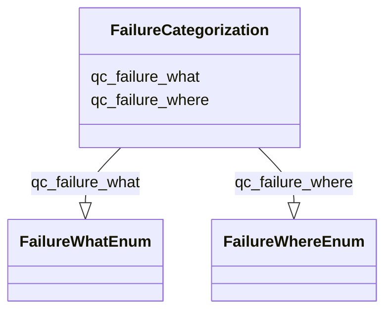

# Class: FailureCategorization


URI: [nmdc:FailureCategorization](https://w3id.org/nmdc/FailureCategorization)





<!-- no inheritance hierarchy -->


## Slots

| Name | Cardinality and Range | Description | Inheritance |
| ---  | --- | --- | --- |
| [qc_failure_what](qc_failure_what.md) | 0..1 <br/> [FailureWhatEnum](FailureWhatEnum.md) | Provides a summary about what caused a lab or workflow process to fail | direct |
| [qc_failure_where](qc_failure_where.md) | 0..1 <br/> [FailureWhereEnum](FailureWhereEnum.md) | Describes the nmdc schema class that corresonds to where the failure occurred | direct |


## Usages

| used by | used in | type | used |
| ---  | --- | --- | --- |
| [FailureCategorization](FailureCategorization.md) | [qc_failure_what](qc_failure_what.md) | domain | [FailureCategorization](FailureCategorization.md) |
| [FailureCategorization](FailureCategorization.md) | [qc_failure_where](qc_failure_where.md) | domain | [FailureCategorization](FailureCategorization.md) |
| [Pooling](Pooling.md) | [has_failure_categorization](has_failure_categorization.md) | range | [FailureCategorization](FailureCategorization.md) |
| [Extraction](Extraction.md) | [has_failure_categorization](has_failure_categorization.md) | range | [FailureCategorization](FailureCategorization.md) |
| [LibraryPreparation](LibraryPreparation.md) | [has_failure_categorization](has_failure_categorization.md) | range | [FailureCategorization](FailureCategorization.md) |
| [CollectingBiosamplesFromSite](CollectingBiosamplesFromSite.md) | [has_failure_categorization](has_failure_categorization.md) | range | [FailureCategorization](FailureCategorization.md) |
| [BiosampleProcessing](BiosampleProcessing.md) | [has_failure_categorization](has_failure_categorization.md) | range | [FailureCategorization](FailureCategorization.md) |
| [SubSamplingProcess](SubSamplingProcess.md) | [has_failure_categorization](has_failure_categorization.md) | range | [FailureCategorization](FailureCategorization.md) |
| [MixingProcess](MixingProcess.md) | [has_failure_categorization](has_failure_categorization.md) | range | [FailureCategorization](FailureCategorization.md) |
| [FiltrationProcess](FiltrationProcess.md) | [has_failure_categorization](has_failure_categorization.md) | range | [FailureCategorization](FailureCategorization.md) |
| [ChromatographicSeparationProcess](ChromatographicSeparationProcess.md) | [has_failure_categorization](has_failure_categorization.md) | range | [FailureCategorization](FailureCategorization.md) |
| [OmicsProcessing](OmicsProcessing.md) | [has_failure_categorization](has_failure_categorization.md) | range | [FailureCategorization](FailureCategorization.md) |
| [WorkflowExecutionActivity](WorkflowExecutionActivity.md) | [has_failure_categorization](has_failure_categorization.md) | range | [FailureCategorization](FailureCategorization.md) |
| [MetagenomeAssembly](MetagenomeAssembly.md) | [has_failure_categorization](has_failure_categorization.md) | range | [FailureCategorization](FailureCategorization.md) |
| [MetatranscriptomeAssembly](MetatranscriptomeAssembly.md) | [has_failure_categorization](has_failure_categorization.md) | range | [FailureCategorization](FailureCategorization.md) |
| [MetagenomeAnnotationActivity](MetagenomeAnnotationActivity.md) | [has_failure_categorization](has_failure_categorization.md) | range | [FailureCategorization](FailureCategorization.md) |
| [MetatranscriptomeAnnotationActivity](MetatranscriptomeAnnotationActivity.md) | [has_failure_categorization](has_failure_categorization.md) | range | [FailureCategorization](FailureCategorization.md) |
| [MetatranscriptomeActivity](MetatranscriptomeActivity.md) | [has_failure_categorization](has_failure_categorization.md) | range | [FailureCategorization](FailureCategorization.md) |
| [MagsAnalysisActivity](MagsAnalysisActivity.md) | [has_failure_categorization](has_failure_categorization.md) | range | [FailureCategorization](FailureCategorization.md) |
| [MetagenomeSequencingActivity](MetagenomeSequencingActivity.md) | [has_failure_categorization](has_failure_categorization.md) | range | [FailureCategorization](FailureCategorization.md) |
| [ReadQcAnalysisActivity](ReadQcAnalysisActivity.md) | [has_failure_categorization](has_failure_categorization.md) | range | [FailureCategorization](FailureCategorization.md) |
| [ReadBasedTaxonomyAnalysisActivity](ReadBasedTaxonomyAnalysisActivity.md) | [has_failure_categorization](has_failure_categorization.md) | range | [FailureCategorization](FailureCategorization.md) |
| [MetabolomicsAnalysisActivity](MetabolomicsAnalysisActivity.md) | [has_failure_categorization](has_failure_categorization.md) | range | [FailureCategorization](FailureCategorization.md) |
| [MetaproteomicsAnalysisActivity](MetaproteomicsAnalysisActivity.md) | [has_failure_categorization](has_failure_categorization.md) | range | [FailureCategorization](FailureCategorization.md) |
| [NomAnalysisActivity](NomAnalysisActivity.md) | [has_failure_categorization](has_failure_categorization.md) | range | [FailureCategorization](FailureCategorization.md) |
| [PlannedProcess](PlannedProcess.md) | [has_failure_categorization](has_failure_categorization.md) | range | [FailureCategorization](FailureCategorization.md) |


## Identifier and Mapping Information


### Schema Source


* from schema: https://w3id.org/nmdc/nmdc


## Mappings

| Mapping Type | Mapped Value |
| ---  | ---  |
| self | nmdc:FailureCategorization |
| native | nmdc:FailureCategorization |


## LinkML Source

<!-- TODO: investigate https://stackoverflow.com/questions/37606292/how-to-create-tabbed-code-blocks-in-mkdocs-or-sphinx -->

### Direct

<details>
```yaml
name: FailureCategorization
from_schema: https://w3id.org/nmdc/nmdc
slots:
- qc_failure_what
- qc_failure_where

```
</details>

### Induced

<details>
```yaml
name: FailureCategorization
from_schema: https://w3id.org/nmdc/nmdc
attributes:
  qc_failure_what:
    name: qc_failure_what
    description: Provides a summary about what caused a lab or workflow process to
      fail
    comments:
    - For example Low read count from a sequencer, malformed fastq files, etc)
    from_schema: https://w3id.org/nmdc/nmdc
    rank: 1000
    domain: FailureCategorization
    alias: qc_failure_what
    owner: FailureCategorization
    domain_of:
    - FailureCategorization
    range: FailureWhatEnum
  qc_failure_where:
    name: qc_failure_where
    description: Describes the nmdc schema class that corresonds to where the failure
      occurred. Most commonly this would be the same as Class that generated the results.
    comments:
    - If the assembly size was too small to proceed to annotation failure_where would
      be MetagenomeAssembly.
    from_schema: https://w3id.org/nmdc/nmdc
    rank: 1000
    domain: FailureCategorization
    alias: qc_failure_where
    owner: FailureCategorization
    domain_of:
    - FailureCategorization
    range: FailureWhereEnum

```
</details>